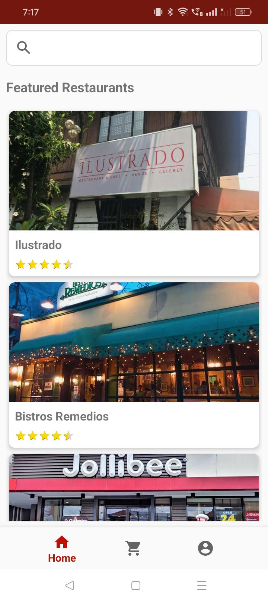
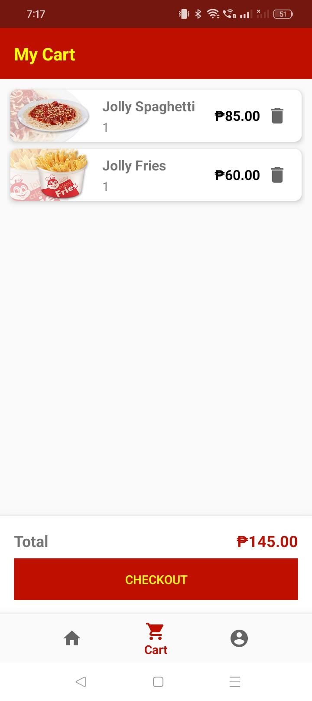
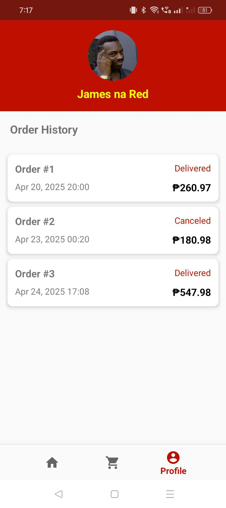

# **Food Delivery App**  
**Application Name: FoodGo**

A modern and user-friendly Food Delivery App that connects users with top-rated restaurants, making ordering food fast, easy, and convenient.

**Application APK**: [Download APK](https://mega.nz/file/WccBDLZb#z2Ku8K9RvJtdfL46LTKH5rRTi2_rsus3PlHjQfPK0Sk)

-------**App Features**-------

### **Home Fragment**
- Search bar at the top for quick restaurant lookup.
- List of featured restaurants displaying:
  - Restaurant image  
  - Name  
  - Rating  

### **Menu Fragment**
- Displays food items from the selected restaurant.
- Each item shows:
  - Food image  
  - Name  
  - Price  
  - “Add to Cart” button  

### **Cart Fragment**
- View all added items.
- Displays total price.
- Includes a “Checkout” button.

### **Profile Fragment**
- Shows user's name and profile picture (placeholder).
- Displays a mocked order history.

-------**SCREENSHOTS**--------

### **Home Fragment Screenshot**


### **Cart Fragment Screenshot**


### **Profile Fragment Screenshot**


-------**GUIDE**--------

### **Prerequisites**
- Android Studio installed
- Android device/emulator
- Java

-------**Installation**--------
1. Clone the repository:
   ```bash
   git clone https://github.com/your_username/food-delivery-app.git
   cd food-delivery-app
